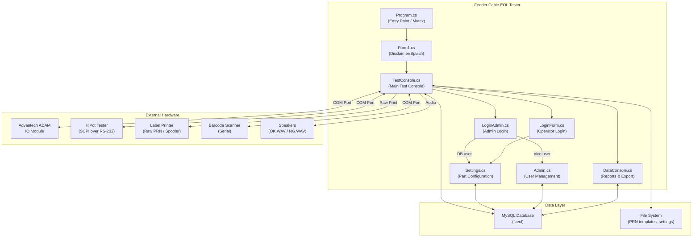
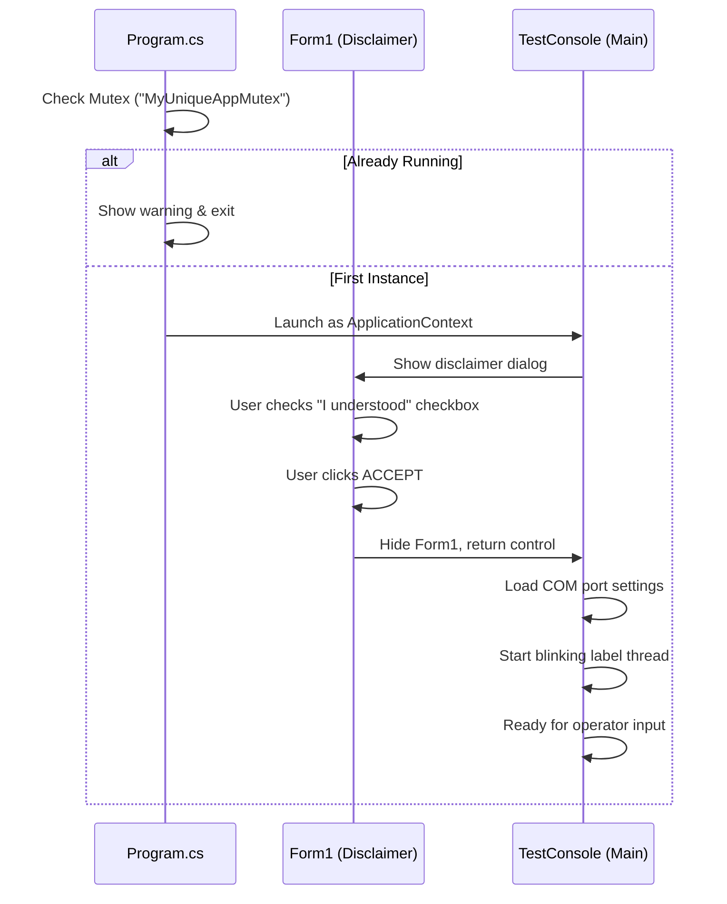
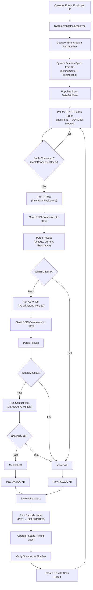
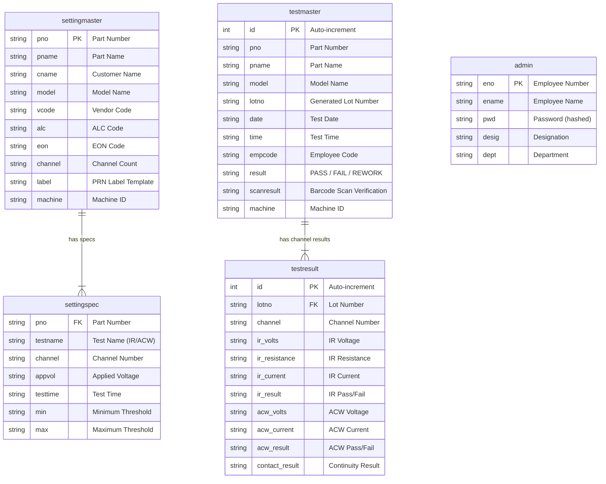
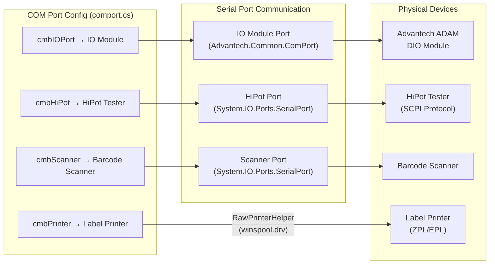
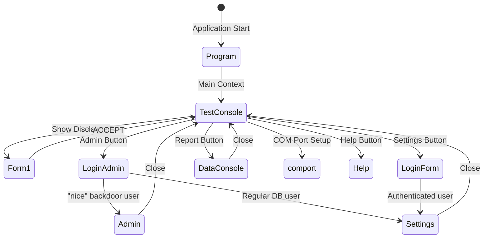
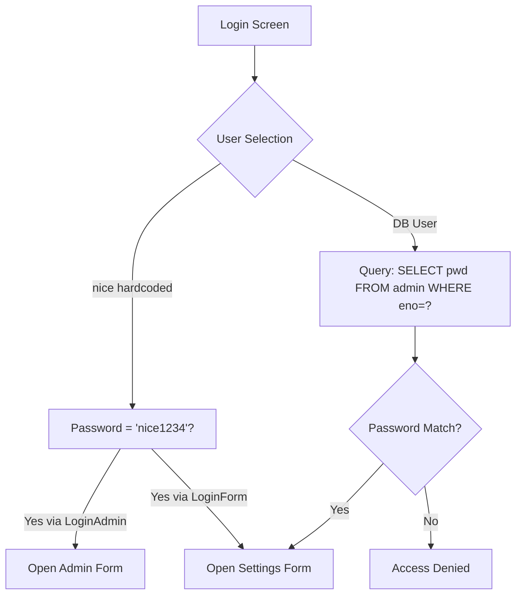

# Feeder Cable — EOL Tester Application

## Architecture & Workflow Reference

> **Technology**: C# Windows Forms (.NET Framework 4.8.1)
> **Database**: MySQL (`fceol` database, localhost)
> **Target**: Industrial End-Of-Line (EOL) testing station for feeder cables

---

## 1. High-Level Architecture



---

## 2. Project Structure

```
Feeder Cable/
├── Program.cs                 # Entry point (single-instance Mutex)
├── Form1.cs                   # Disclaimer/splash screen
├── TestConsole.cs             # ★ CORE — Main testing workflow (80KB)
├── Settings.cs                # ★ Part/spec configuration (41KB)
├── DataConsole.cs             # ★ Reporting & Excel export (12KB)
├── Admin.cs                   # Admin user CRUD
├── LoginAdmin.cs              # Admin authentication gate
├── LoginForm.cs               # Operator authentication gate
├── Function.cs                # Database connection helper
├── Help.cs                    # Help form (placeholder)
├── comport.cs                 # COM port configuration & diagnostics
├── RS-232C_USB.cs             # Serial communication wrapper
├── RawPrinterHelper.cs        # Windows Print Spooler P/Invoke
├── WaterMarkTextBox.cs        # Custom placeholder TextBox control
├── InputDataProcessor.cs      # Empty placeholder class
├── adamtest.cs                # ADAM IO module test form
├── Common/
│   ├── Constants.cs           # Hardcoded config (Machine ID, paths)
│   ├── BlinkProvider.cs       # Label blink animation provider
│   ├── ControlMover.cs        # Runtime UI control drag utility
│   ├── Helper.cs              # Password hashing (MD5/SHA)
│   └── RawPrinterHelper.cs    # Duplicate printer helper
├── App.config                 # User settings (COM, baud, machine ID)
├── packages.config            # NuGet package manifest
├── FeederCable.csproj         # Project file (.NET 4.8.1)
├── *.prn                      # Printer label templates (ZPL/EPL)
├── *.WAV                      # Audio feedback files
└── emp.txt / employeecode.txt # Employee ID storage
```

---

## 3. Application Startup Flow



### Startup Details

| Step | Component | Action |
|------|-----------|--------|
| 1 | `Program.cs` | Creates a named `Mutex` to enforce single-instance |
| 2 | `Program.cs` | Launches `TestConsole` as the main application context |
| 3 | `TestConsole` | Constructor loads COM port settings from `Properties.Settings` |
| 4 | `TestConsole` | Shows `Form1` (disclaimer/instructions splash) as a dialog |
| 5 | `Form1` | User must check acknowledgment checkbox to enable ACCEPT |
| 6 | `TestConsole` | Main console becomes active and ready for testing |

---

## 4. Core Testing Workflow (TestConsole.cs)

This is the heart of the application — the complete cable testing sequence:



### Test Sequence Details

#### Step 1: Insulation Resistance (IR) Test
| Aspect | Detail |
|--------|--------|
| **Device** | HiPot Tester via Serial Port (SCPI) |
| **Commands Sent** | `MANU:EDIT:MODE IR`, `FUNC:TEST ON`, `MEAS?` |
| **Response Format** | Comma-separated: Voltage, Current, Resistance |
| **Validation** | Check against `IRmin`/`IRmax` from `settingspec` table |

#### Step 2: AC Withstand Voltage (ACW) Test
| Aspect | Detail |
|--------|--------|
| **Device** | HiPot Tester via Serial Port (SCPI) |
| **Commands Sent** | `MANU:EDIT:MODE ACW`, `FUNC:TEST ON`, `MEAS?` |
| **Response Format** | Comma-separated: Voltage, Current |
| **Validation** | Check against `acwmin`/`acwmax` from `settingspec` table |

#### Step 3: Contact/Continuity Test
| Aspect | Detail |
|--------|--------|
| **Device** | Advantech ADAM IO Module via COM Port |
| **Method** | Send digital signals, read back continuity state |
| **Commands** | ASCII strings like `#010000`, `$016` |
| **Validation** | Binary pass/fail based on IO state |

#### Step 4: Result Processing
| Outcome | Actions |
|---------|---------|
| **PASS** | Play `OK.WAV`, set background Blue, save to DB, print label |
| **FAIL** | Play `NG.WAV`, set background Red, save to DB, print label |

---

## 5. Database Schema

### MySQL Database: `fceol`

**Connection**: `server=localhost; database=fceol; user=root; password=root;`
(Defined in `Function.cs`)



### Table Purposes

| Table | Purpose | Used By |
|-------|---------|---------|
| `settingmaster` | Stores part/product configuration | Settings.cs, TestConsole.cs |
| `settingspec` | Stores test limits per channel per part | Settings.cs, TestConsole.cs |
| `testmaster` | Records each test execution | TestConsole.cs, DataConsole.cs |
| `testresult` | Records per-channel test measurements | TestConsole.cs, DataConsole.cs |
| `admin` | Stores admin/operator credentials | Admin.cs, LoginAdmin.cs, LoginForm.cs |

---

## 6. Hardware Communication Layer



### Communication Protocols

| Device | Protocol | Library | Key Commands |
|--------|----------|---------|--------------|
| **ADAM IO Module** | ASCII over Serial | `Advantech.Common.ComPort` | `#010000`, `$016`, `$015` |
| **HiPot Tester** | SCPI over RS-232 | `System.IO.Ports.SerialPort` | `*IDN?`, `MANU:EDIT:MODE IR`, `FUNC:TEST ON`, `MEAS?` |
| **Barcode Scanner** | Serial Input | `System.IO.Ports.SerialPort` | Passive — reads scanned data |
| **Label Printer** | Raw PRN (ZPL/EPL) | `winspool.drv` P/Invoke | Template file with string substitution |
| **Audio** | WAV Playback | `System.Media.SoundPlayer` | `OK.WAV`, `NG.WAV` |

---

## 7. Form Navigation Map



### Form Descriptions

| Form | File | Purpose |
|------|------|---------|
| **TestConsole** | `TestConsole.cs` | Main operational screen — runs tests, shows results, prints labels |
| **Form1** | `Form1.cs` | Disclaimer/safety acknowledgment splash screen |
| **Settings** | `Settings.cs` | Part configuration — create/edit/delete test specifications |
| **Admin** | `Admin.cs` | Admin user management — CRUD operations on `admin` table |
| **LoginAdmin** | `LoginAdmin.cs` | Admin login gate — routes to Admin or Settings based on user |
| **LoginForm** | `LoginForm.cs` | Operator login gate — routes to Settings |
| **DataConsole** | `DataConsole.cs` | Historical test data viewer with Excel export |
| **comport** | `comport.cs` | COM port assignment and hardware diagnostics |
| **Help** | `Help.cs` | Help screen (currently a placeholder) |
| **adamtest** | `adamtest.cs` | ADAM IO module diagnostic test |

---

## 8. Authentication System



> [!WARNING]
> **Security Concerns Identified:**
> - Hardcoded backdoor credentials (`nice` / `nice1234`) in both `LoginAdmin.cs` and `LoginForm.cs`
> - Database credentials hardcoded in `Function.cs` (`root` / `root`)
> - Password hashing utilities exist in `Helper.cs` (MD5/SHA) but usage in login flow appears inconsistent

---

## 9. External Dependencies (NuGet Packages)

| Package | Version | Purpose |
|---------|---------|---------|
| `MySql.Data` | 8.0.22 | MySQL database connectivity |
| `ClosedXML` | 0.102.2 | Excel file generation |
| `DocumentFormat.OpenXml` | — | Excel/OpenXML support |
| `GodSharp.Advantech.Adam` | — | Advantech ADAM IO module communication |
| `NModbus` | — | Modbus industrial protocol |
| `AForge.Video.DirectShow` | — | Camera/scanner video integration |
| `ZXing` | — | Barcode reading/decoding |
| `iTextSharp` | — | PDF generation |
| `SSH.NET` | — | SSH/SFTP connectivity |
| `BouncyCastle` | — | Cryptographic operations |
| `Google.Protobuf` | — | Protocol buffer serialization |

---

## 10. Key Data Flows

### 10.1 Part Configuration Flow (Settings.cs)

```
Operator → LoginForm → Settings Form
  ├── CREATE: Fill form → INSERT settingmaster + settingspec
  ├── READ:   Select part from grid → Populate form fields
  ├── UPDATE: Modify fields → UPDATE settingmaster + settingspec
  └── DELETE: Select part → DELETE from both tables
```

### 10.2 Test Execution Flow (TestConsole.cs)

```
Operator enters Employee ID + Part Number
  → System loads specs from DB
  → Polls ADAM IO for START button
  → Checks cable connection via IO
  → Runs IR Test (HiPot SCPI)
  → Runs ACW Test (HiPot SCPI)
  → Runs Contact Test (ADAM IO)
  → Calculates overall result
  → Saves to testmaster + testresult
  → Prints barcode label (PRN → printer)
  → Operator scans label for verification
  → Updates DB with scan result
  → Loop back to START
```

### 10.3 Reporting Flow (DataConsole.cs)

```
User selects Date Range + Part Number + Result Filter
  → JOIN query on testmaster + testresult
  → Display in DataGridView
  → Optional: Export to .xlsx via OpenXML SDK
```

---

## 11. File Assets

| File | Type | Purpose |
|------|------|---------|
| `OK.WAV` | Audio | Played on test PASS |
| `NG.WAV` | Audio | Played on test FAIL |
| `HMI DATAMATRIX.prn` | Printer Template | Barcode label with placeholder substitution |
| `BARCODE FINAL.prn` | Printer Template | Alternative barcode format |
| `DATAMATRIX FINAL.prn` | Printer Template | Data matrix label |
| `VW DATAMATRIX.prn` | Printer Template | VW-specific label |
| `M&M DATAMATRIX.prn` | Printer Template | M&M-specific label |
| `MGI DATAMATRIX.prn` | Printer Template | MGI-specific label |
| `emp.txt` | Data | Current employee ID storage |
| `employeecode.txt` | Data | Employee code reference |
| `listofprnfile.txt` | Config | List of available PRN templates |
| `FC EOL.ico` | Icon | Application icon |
| `nice.jpeg` | Image | Branding/logo |
| `operator_instructions.jpeg` | Image | Operator instruction visual |

---

## 12. Identified Code Issues & Technical Debt

> [!IMPORTANT]
> The following issues were identified during the code review:

| # | Issue | Location | Severity |
|---|-------|----------|----------|
| 1 | **Hardcoded DB credentials** (`root`/`root`) | `Function.cs` | 🔴 Critical |
| 2 | **Hardcoded backdoor account** (`nice`/`nice1234`) | `LoginAdmin.cs`, `LoginForm.cs` | 🔴 Critical |
| 3 | **Hardcoded COM port** ("COM3") in `OpenInterface()` ignores parameters | `RS-232C_USB.cs` | 🟡 Medium |
| 4 | **No connection pooling or disposal** — `MySqlConnection` not wrapped in `using` | `Function.cs` | 🟡 Medium |
| 5 | **Empty class** — `InputDataProcessor.cs` has no implementation | `InputDataProcessor.cs` | 🟢 Low |
| 6 | **Duplicate file** — `RawPrinterHelper.cs` exists in both root and `Common/` | Root + `Common/` | 🟢 Low |
| 7 | **Help form** is a placeholder with commented-out code | `Help.cs` | 🟢 Low |
| 8 | **No async/await** — Serial port operations block the UI thread | `TestConsole.cs` | 🟡 Medium |
| 9 | **String concatenation for SQL** — potential SQL injection risk | Multiple files | 🔴 Critical |
| 10 | **Legacy commented-out ActiveX code** in `adamtest.cs` | `adamtest.cs` | 🟢 Low |

---

## 13. Summary

The **Feeder Cable EOL Tester** is an industrial Windows Forms application designed for **End-Of-Line electrical testing** of feeder cables on a manufacturing floor. It:

1. **Authenticates** operators via a MySQL-backed login system
2. **Configures** test parameters (IR/ACW voltage, current, resistance thresholds) per part number
3. **Executes** automated electrical safety tests using:
   - **HiPot Tester** (Insulation Resistance + AC Withstand Voltage) via SCPI/RS-232
   - **Advantech ADAM IO Module** (Continuity/Contact testing + physical button polling)
4. **Records** all test results to MySQL with per-channel granularity
5. **Prints** barcode labels via raw printer commands to industrial label printers
6. **Verifies** printed labels by scanning and cross-checking against the database
7. **Reports** historical data with date/part/result filtering and Excel export

The application follows a **monolithic single-project architecture** with all forms, utilities, and hardware communication in a single C# project targeting .NET Framework 4.8.1.
