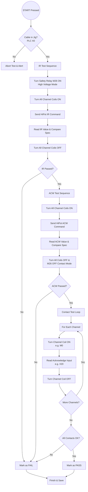

# Feeder Cable EOL Test Console Workflow

This document explains the end-to-end workflow of the `test_console.py` page. This page serves as the primary operational interface for the Feeder Cable End-Of-Line (EOL) tester, coordinating the UI, Database, PLC (Modbus), HiPot tester (Serial), Printer, and Scanner.

## 1. Setup & Preparation phase
Before any testing can begin, the system and operator must complete the setup loop:
1. **Operator Input**: The operator enters a **Part Number (PNO)** and presses Enter.
2. **Database Lookup**: The system queries the MySQL database (`fceol`) to load:
   - Part metadata (Model, ALC, Name).
   - Test specifications for IR (Insulation Resistance) and ACW (Withstand Voltage) for the required number of channels.
   - Historical pass/fail counts for the day.
3. **Validation**: The operator enters their **Employee ID**, which is validated against a local `emp.txt` file.
4. **Ready State**: The background polling thread (`_input_poll_once`) starts monitoring the PLC for the physical START button (X1) and continuously updates the live I/O UI indicators (X20-X27).

## 2. Test Execution Sequence
Once the operator presses the physical **START button** (or clicks the UI button), the automated test sequence (`_run_test_sequence`) begins.

### Deep Dive into Test Stages:
* **IR Test (Insulation Resistance)**: 
  * The PLC switches the Safety Relay (M26) to High Voltage mode. This physically routes the circuit away from the contact testing board to prevent blowing up the low-voltage electronics.
  * All active channel coils are turned ON simultaneously.
  * A serial command is sent to the HiPot tester. The app waits for the test to complete, reads the Mega-Ohm (MΩ) value, and checks it against the database spec.
* **ACW Test (Withstand Voltage)**: 
  * Similar to IR, the Safety Relay remains in HV mode, and all channel coils are turned ON. 
  * The HiPot tester applies high voltage to check for leakage current (mA).
  * *Crucial Step*: After ACW finishes, the PLC turns OFF all channel coils and switches the Safety Relay (M26) OFF, reverting the hardware back to Contact/Low-Voltage mode.
* **Contact Test (Continuity/Wiring)**:
  * Iterates through every channel individually (1 up to 8).
  * Turns ON a specific coil (e.g., M0 for CH1).
  * Reads the specific acknowledge input (e.g., X20 for CH1).
  * If the signal loops back successfully, the channel passes.

## 3. Post-Test & Data Handling (`_finish_test`)
After all tests execute (or immediately upon a failure):
1. **Result Evaluation**: If IR, ACW, and Contact tests all passed, the overall result is `PASS`. Otherwise, it's `FAIL`.
2. **Database Save**: 
   - A unique Lot Number is generated.
   - Saves overall metadata to the `testmaster` table.
   - Saves per-channel voltages, currents, resistances, and results to the `testresult` table.
3. **UI Updates**:
   - Updates the daily PASS/FAIL counters and the historical list.
   - Screen flashes Green (PASS) or Red (FAIL).
   - Plays audio feedback (`OK.WAV` or `NG.WAV`).
4. **Barcode Workflow (If PASS)**:
   - A background thread sends raw ZPL/PRN data to the EOL Label Printer (`win32print`) to print the barcode label.
   - A scan entry box appears on the UI. The operator must use a barcode scanner to scan the newly printed label.
   - If the scanned label matches the generated Lot Number, the database `scanresult` is updated to 'OK', and the system resets for the next cable.
   - If `FAIL`, the system skips printing and immediately prompts the operator to remove the bad cable and try the next one.
